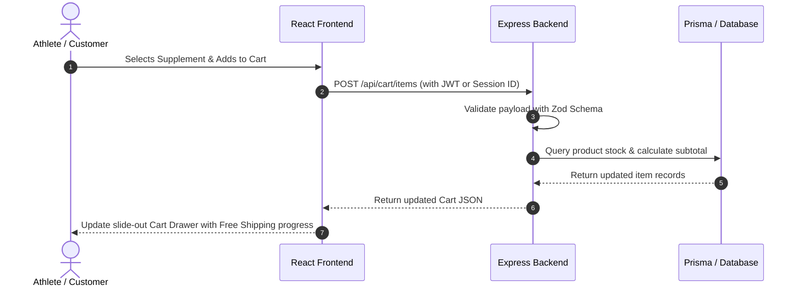

# 🏗️ System Architecture & Design

This document details the architectural foundation, layer segregation, security model, and data communication patterns of the **Protein Villa** 3-tier application.

---

## 1. 3-Tier Architecture Diagram

```mermaid
graph TD
    subgraph Tier 1: Presentation Layer
        A[React 18 + TypeScript + Vite]
        B[Tailwind CSS + Dark/Light Theme Engine]
        C[Three.js / React Three Fiber 3D Jar Canvas]
        D[Recharts Analytics + Canvas Confetti]
        E[Context Providers: Auth, Cart, Wishlist, Compare, Toast]
    end

    subgraph Tier 2: Application / API Layer
        F[Node.js + Express.js + TypeScript]
        G[Middleware: RateLimiter, Helmet, CORS, ErrorHandler]
        H[Security: JWT Authentication & RBAC Guards]
        I[Validation: Zod Schema Validators]
        J[Controllers & Business Logic Services]
    end

    subgraph Tier 3: Data / Persistence Layer
        K[Prisma ORM Client]
        L[Relational Schema: 16 Models]
        M[(SQLite Local / PostgreSQL Enterprise)]
    end

    Tier 1 -->|HTTPS / REST API / JSON| Tier 2
    Tier 2 -->|Type-Safe Prisma Queries| Tier 3
```

---

## 2. Layer Breakdown

### **Tier 1: Presentation Layer (Frontend)**
* **Location:** `frontend/`
* **Entry Point:** `src/main.tsx` & `src/App.tsx`
* **Responsibilities:**
  * Client-side routing with React Router (`/`, `/products`, `/checkout`, `/admin`, etc.).
  * Rendering interactive 3D WebGL scenes for supplement tubs using Three.js and `@react-three/fiber`.
  * Real-time calculators (Harris-Benedict BMR, ISSN protein targets, macronutrient splits).
  * State management via contextual providers (`AuthContext`, `CartContext`, `WishlistContext`, `CompareContext`).
  * Responsive user interface styled with Tailwind CSS, supporting seamless dark and light modes.

### **Tier 2: Application Layer (Backend)**
* **Location:** `backend/`
* **Entry Point:** `src/index.ts` & `src/app.ts`
* **Responsibilities:**
  * REST API routing with structured `/api/*` endpoints.
  * Request payload validation using strict Zod schemas before hitting business logic.
  * Stateless authentication using signed JSON Web Tokens (JWT).
  * Role-Based Access Control (RBAC) ensuring only `ADMIN` roles access `/api/admin/*`.
  * Comprehensive business services for Cart calculations, Coupon discounts, Order creation, and HPLC verification code lookups.

### **Tier 3: Database & Persistence Layer**
* **Location:** `backend/prisma/`
* **Schema File:** `backend/prisma/schema.prisma`
* **Responsibilities:**
  * Enforcing data integrity with 16 relational tables and foreign key cascade rules.
  * Providing type-safe database queries via Prisma Client.
  * Support for zero-config SQLite locally (`backend/prisma/dev.db`) and instant migration to PostgreSQL/MySQL in production.

---

## 3. Data Flow & Security Model



### Security Measures Implemented:
1. **Password Encryption:** Bcrypt with 10 salt rounds.
2. **JWT Authorization:** Tokens containing user ID and role, validated on protected routes.
3. **Admin Guarding:** Middleware verifies `user.role === 'ADMIN'`, returning HTTP 403 Forbidden for unauthorized requests.
4. **Rate Limiting:** Protects authentication and tracking endpoints from brute-force attempts.
5. **CORS & HTTP Headers:** Configured with Helmet and customizable CORS origins.
