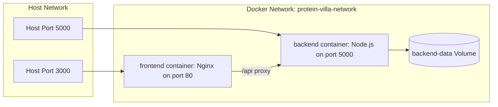

# 🐳 Docker & Container Deployment Guide

This guide details how to build multi-stage Docker images, configure bridge networking, manage persistent volumes, and run the entire full-stack application using **Docker Compose**.

---

## 1. Prerequisites

* **Docker Engine:** v20.10+ (tested on Docker v29.4.0)
* **Docker Compose:** v2.0+

Verify your Docker installation:
```bash
docker --version
docker compose version
```

---

## 2. Docker Architecture Overview



---

## 3. Quickstart: Run with Docker Compose

To build and run all containers in the background with a single command:

```bash
docker-compose up --build -d
```

### Check Container Status
```bash
docker-compose ps
```

### View Live Container Logs
```bash
# Stream all logs
docker-compose logs -f

# Stream only backend logs
docker-compose logs -f backend

# Stream only frontend logs
docker-compose logs -f frontend
```

### Accessing the Running Application
* **Frontend App:** [http://localhost:3000](http://localhost:3000)
* **Backend Healthcheck:** [http://localhost:5000/api/health](http://localhost:5000/api/health)

---

## 4. Multi-Stage Dockerfile Explanations

### **Backend Multi-Stage Dockerfile (`backend/Dockerfile`)**
1. **Stage 1 (Builder):** Uses `node:20-alpine`, installs dependencies, generates the Prisma client, and compiles TypeScript into `dist/`.
2. **Stage 2 (Runner):** Creates a minimal production image containing only production dependencies (`--omit=dev`) and the compiled `dist/` bundle.
3. **Benefits:** Keeps final image size under 150MB, minimizes security vulnerabilities, and eliminates development toolchains from production.

### **Frontend Multi-Stage Dockerfile (`frontend/Dockerfile`)**
1. **Stage 1 (Builder):** Compiles React components, Tailwind styles, and Three.js 3D assets with `npm run build`.
2. **Stage 2 (Runner):** Uses lightweight `nginx:alpine` to serve static assets with gzip compression, SPA client-side routing, and reverse proxy rules for `/api`.

---

## 5. Stopping and Cleaning Up Containers

```bash
# Stop and remove containers
docker-compose down

# Stop, remove containers, and delete persistent volumes
docker-compose down -v
```

---

## 6. Manual Docker Image Building (Optional)

If you prefer building and running images manually without Docker Compose:

```bash
# 1. Create bridge network
docker network create protein-villa-net

# 2. Build backend image
cd backend
docker build -t protein-villa-backend:latest .

# 3. Run backend container
docker run -d \
  --name pv-backend \
  --network protein-villa-net \
  -p 5000:5000 \
  -e NODE_ENV=production \
  -e DATABASE_URL="file:./dev.db" \
  protein-villa-backend:latest

# 4. Build frontend image
cd ../frontend
docker build -t protein-villa-frontend:latest .

# 5. Run frontend container
docker run -d \
  --name pv-frontend \
  --network protein-villa-net \
  -p 3000:80 \
  protein-villa-frontend:latest
```
