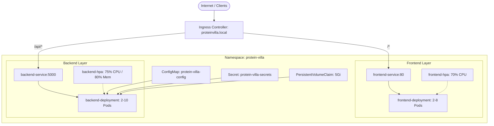

# ☸️ Kubernetes (K8s) Production Deployment Guide

This comprehensive guide walks you through deploying the **Protein Villa** microservices architecture onto any standard Kubernetes cluster (Minikube, Kind, AWS EKS, Google GKE, Azure AKS, or bare-metal K8s).

---

## 1. Kubernetes Architecture Overview



---

## 2. Directory Structure of Manifests

All Kubernetes YAML manifests are organized under the `k8s/` folder:

```
k8s/
├── namespace.yaml              # Creates the isolated 'protein-villa' namespace
├── configmap.yaml              # Non-sensitive configuration (Ports, CORS, log levels)
├── secrets.yaml                # Sensitive secrets (JWT secret, DB connection strings)
├── persistent-volume.yaml      # 5Gi Persistent Volume Claim for database storage
├── backend-deployment.yaml     # Express API Deployment & ClusterIP Service
├── frontend-deployment.yaml    # React Nginx Deployment & ClusterIP Service
├── pod.yaml                    # Standalone pod definitions for testing and debugging
├── hpa.yaml                    # HorizontalPodAutoscalers for automatic scaling
├── ingress.yaml                # Nginx Ingress routing and CORS annotations
└── kustomization.yaml          # Unified Kustomize orchestration file
```

---

## 3. Step-by-Step Deployment Guide

### **Step 1: Set Up Your Kubernetes Cluster**
Ensure `kubectl` is connected to your desired cluster:
```bash
kubectl cluster-info
```

### **Step 2: Build & Tag Container Images**
If using a local cluster (like Minikube or Kind):
```bash
# For Minikube: point terminal to Minikube's Docker daemon
eval $(minikube docker-env)

# Build images
docker build -t protein-villa-backend:latest ./backend
docker build -t protein-villa-frontend:latest ./frontend
```
*If using a remote registry (Docker Hub, AWS ECR, GCP GCR), push images and update the image tags in `k8s/backend-deployment.yaml` and `k8s/frontend-deployment.yaml`.*

---

### **Step 3: Deploy All Resources**

#### **Option A: 1-Click Deployment with Kustomize (Recommended)**
```bash
kubectl apply -k k8s/
```

#### **Option B: Apply Manifests Sequentially**
```bash
# 1. Create isolated namespace
kubectl apply -f k8s/namespace.yaml

# 2. Apply ConfigMap and Secrets
kubectl apply -f k8s/configmap.yaml
kubectl apply -f k8s/secrets.yaml

# 3. Provision Persistent Storage Claim
kubectl apply -f k8s/persistent-volume.yaml

# 4. Deploy Backend & Frontend Microservices
kubectl apply -f k8s/backend-deployment.yaml
kubectl apply -f k8s/frontend-deployment.yaml

# 5. Enable Horizontal Pod Autoscaling (HPA)
kubectl apply -f k8s/hpa.yaml

# 6. Configure Ingress Gateway
kubectl apply -f k8s/ingress.yaml
```

---

## 4. Verification & Inspection

### Check All Resources in the Namespace:
```bash
kubectl get all -n protein-villa
```

### Check Pod Status and Probes:
```bash
kubectl get pods -n protein-villa -o wide
```

### Inspect Live Logs:
```bash
# Stream backend API logs
kubectl logs -n protein-villa -l app=protein-villa-backend -f

# Stream frontend Nginx logs
kubectl logs -n protein-villa -l app=protein-villa-frontend -f
```

### Verify Auto-Scaling (HPA) Metrics:
```bash
kubectl get hpa -n protein-villa
```

---

## 5. Exposing the Application

### Option A: Port-Forwarding (For Local Testing)
```bash
# Port-forward frontend service to http://localhost:8080
kubectl port-forward -n protein-villa svc/frontend-service 8080:80

# In a second terminal: port-forward backend service to http://localhost:5000
kubectl port-forward -n protein-villa svc/backend-service 5000:5000
```
Open **`http://localhost:8080`** in your browser.

### Option B: Access via Ingress Controller
1. Ensure the Nginx Ingress Controller is enabled:
   ```bash
   minikube addons enable ingress
   ```
2. Add the host entry in your local `/etc/hosts` (Linux/Mac) or `C:\Windows\System32\drivers\etc\hosts` (Windows):
   ```
   127.0.0.1 proteinvilla.local
   ```
3. Navigate to **`http://proteinvilla.local`** in your browser.

---

## 6. Zero-Downtime Rolling Updates

When rolling out updates to the application:
```bash
# Update backend image
kubectl set image deployment/protein-villa-backend backend=protein-villa-backend:v2.0.0 -n protein-villa

# Monitor rollout progression
kubectl rollout status deployment/protein-villa-backend -n protein-villa

# Rollback in case of failure
kubectl rollout undo deployment/protein-villa-backend -n protein-villa
```

---

## 7. Teardown / Deletion

To completely delete all Protein Villa resources:
```bash
kubectl delete -k k8s/
# OR
kubectl delete namespace protein-villa
```
