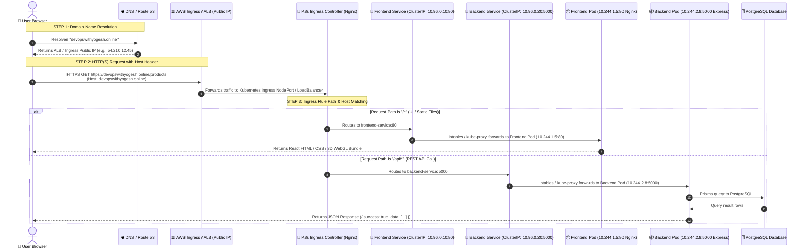

# 🌐 How Request Traffic Flows from Your Custom Domain to Kubernetes Pods

This guide explains the **end-to-end packet journey** of how a user request for your domain **`devopswithyogesh.online`** (or **`www.devopswithyogesh.online`**) travels across the internet, passes through AWS DNS, hits the Ingress Load Balancer, gets dispatched by Kubernetes Services, and reaches your backend/frontend Pods.

---

## 1. End-to-End Visual Request Flow Diagram



---

## 2. Deep Dive: The 6 Steps of Request Journey

---

### **Step 1: Domain Resolution via DNS (Route 53 or Domain Registrar)**
1. The user types `https://devopswithyogesh.online` into their browser.
2. The browser sends a DNS query to your DNS provider (e.g., AWS Route 53, Cloudflare, GoDaddy, or Namecheap).
3. The DNS server looks up the **A / CNAME Record** configured for `devopswithyogesh.online` and returns the **Public IP Address** (or CNAME) of your Kubernetes Ingress Load Balancer / AWS ALB.

```
devopswithyogesh.online ➔ CNAME ➔ k8s-proteinv-proteinv-123456.us-east-1.elb.amazonaws.com (IP: 54.210.12.45)
www.devopswithyogesh.online ➔ CNAME ➔ k8s-proteinv-proteinv-123456.us-east-1.elb.amazonaws.com
```

---

### **Step 2: Reaching the Ingress Gateway (Port 80 / 443)**
1. The user's browser establishes a secure **TLS / HTTPS** handshake on port `443` with the Load Balancer.
2. The browser sends the HTTP request with the HTTP **`Host:`** header:
   ```http
   GET /api/products HTTP/1.1
   Host: devopswithyogesh.online
   User-Agent: Mozilla/5.0 ...
   Authorization: Bearer <jwt-token>
   ```

---

### **Step 3: Ingress Controller Evaluation (`k8s/ingress.yaml`)**
The Ingress Controller (Nginx Ingress / AWS ALB Ingress) inspects:
1. **Host Header:** Does `devopswithyogesh.online` or `www.devopswithyogesh.online` match any Ingress rules? ➔ **YES!**
2. **URL Path Prefix:**
   * If the path begins with **`/api`** (e.g., `/api/products`, `/api/auth/login`, `/api/calculators/protein`):
     ➔ Routes to **`backend-service:5000`**.
   * If the path is anything else (e.g., `/`, `/products`, `/checkout`, `/assets/index.js`):
     ➔ Routes to **`frontend-service:80`**.

Here is the exact rule in your [`k8s/ingress.yaml`](../k8s/ingress.yaml):
```yaml
spec:
  rules:
    - host: devopswithyogesh.online
      http:
        paths:
          - path: /api
            pathType: Prefix
            backend:
              service:
                name: backend-service
                port:
                  number: 5000
          - path: /
            pathType: Prefix
            backend:
              service:
                name: frontend-service
                port:
                  number: 80
```

---

### **Step 4: Kubernetes Service Layer (Virtual IP & Load Balancing)**
* **Why do we need a Service?**
  * In Kubernetes, Pods are ephemeral; their IP addresses change every time a pod is recreated or scaled.
  * The `Service` provides a **stable Virtual IP (ClusterIP)** and DNS name (`backend-service.protein-villa.svc.cluster.local`).
* **How does traffic reach the Pod?**
  * `kube-proxy` writes `iptables` / `IPVS` rules on every worker node.
  * When traffic hits `backend-service:5000`, the kernel randomly load-balances the TCP connection across healthy backend pod replicas (`10.244.1.15:5000`, `10.244.2.22:5000`).

---

### **Step 5: Inside the Pod Containers**

#### **Case A: Frontend Request (`/*`)**
* Traffic reaches the **Frontend Pod** on port `80`.
* Inside the pod, the lightweight **Nginx web server** (`frontend/Dockerfile`) serves the compiled React HTML, CSS, JavaScript, and Three.js 3D WebGL assets.
* If the user accesses client routes like `/products/pv-iso-gold-100-whey-isolate`, Nginx's `try_files $uri $uri/ /index.html;` ensures the React SPA router takes over without 404 errors.

#### **Case B: Backend Request (`/api/*`)**
* Traffic reaches the **Backend Pod** on port `5000`.
* Inside the pod, the **Node.js Express application** (`backend/src/index.ts`):
  1. Validates JWT credentials and Zod request body schemas.
  2. Executes business logic (calculating macros, processing cart items).
  3. Queries the PostgreSQL RDS database via Prisma ORM.
  4. Returns the JSON response payload.

---

## 3. How to Connect `devopswithyogesh.online` to Your Kubernetes Ingress

Follow these steps to link your domain:

### 1. Get the External IP or DNS Name of Your Ingress
Run this command in your terminal:
```bash
kubectl get ingress -n protein-villa
```
**Example Output:**
```
NAME                    CLASS   HOSTS                                              ADDRESS                                               PORTS     AGE
protein-villa-ingress   nginx   devopswithyogesh.online,www.devopswithyogesh.online   k8s-proteinv-1234567890.us-east-1.elb.amazonaws.com   80, 443   10m
```

---

### 2. Configure DNS Records in Your Domain Registrar / Route 53

Open your DNS management dashboard (AWS Route 53, GoDaddy, Cloudflare, or Namecheap) and create two records:

| Type | Name / Host | Target / Value | TTL |
| :--- | :--- | :--- | :--- |
| **CNAME** (or A-Alias) | `@` (or `devopswithyogesh.online`) | `k8s-proteinv-1234567890.us-east-1.elb.amazonaws.com` | Automatic / 300s |
| **CNAME** | `www` (or `www.devopswithyogesh.online`) | `k8s-proteinv-1234567890.us-east-1.elb.amazonaws.com` | Automatic / 300s |

---

### 3. Verify DNS Propagation
Test that your domain resolves to the Load Balancer:
```bash
nslookup devopswithyogesh.online
# OR
dig devopswithyogesh.online +short
```

---

### 4. Test Live HTTPS Requests

```bash
# 1. Test Backend API through your domain:
curl -I https://devopswithyogesh.online/api/health

# Expected Response:
# HTTP/2 200
# content-type: application/json; charset=utf-8

# 2. Test Frontend UI in your browser:
# Open https://devopswithyogesh.online in Chrome / Firefox
```
