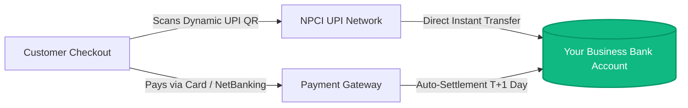

# 🏦 Admin Guide: Bank Account & Direct UPI Payment Configuration

> **Protein Villa E-Commerce Platform**  
> *Complete Guide for Store Owners & Administrators on configuring Bank Accounts, Merchant UPI QR codes, and Payment Gateways to receive payments directly into your Current/Savings Bank Account.*

---

## 📑 Table of Contents
1. [How Direct Bank Settlements Work](#1-how-direct-bank-settlements-work)
2. [Method 1: Direct Merchant UPI QR Code (0% Transaction Fee)](#2-method-1-direct-merchant-upi-qr-code-0-fee)
3. [Method 2: Credit/Debit Cards & Net Banking (Payment Gateways)](#3-method-2-creditdebit-cards--payment-gateways)
4. [Method 3: Cash on Delivery (COD) Courier Bank Remittance](#4-method-3-cash-on-delivery-cod-remittance)
5. [Configuration File Locations (Where to Input Keys)](#5-configuration-file-locations)
6. [Testing & Verifying Live ₹1 Settlement](#6-testing--verifying-live-1-settlement)

---

## 1. How Direct Bank Settlements Work



When customers order from Protein Villa, you receive payments through two primary channels:
1. **Direct UPI QR Code**: Customer scans the dynamic QR code (with exact order amount pre-filled) via Google Pay, PhonePe, Paytm, or CRED. Funds land **instantly directly into your linked bank account** with **0% gateway fees**.
2. **Card Gateway (Razorpay / Cashfree / Stripe)**: Customers pay via Credit Card, Debit Card, or EMI. The gateway securely processes the payment and auto-settles the balance into your bank account on a **daily (T+1)** basis.

---

## 2. Method 1: Direct Merchant UPI QR Code (0% Fee)

### Step 1: Obtain a Merchant UPI VPA Linked to your Bank Account
You can get a free Merchant UPI ID linked directly to your business current or savings account through any of the following:

| Bank / Provider | Merchant App | Example UPI VPA | Settlement Speed |
| :--- | :--- | :--- | :--- |
| **HDFC Bank** | HDFC SmartHub Vyapar | `yourbusiness@okhdfcbank` | Instant Real-Time |
| **ICICI Bank** | ICICI InstaBIZ / Eazypay | `yourbusiness@icici` | Instant Real-Time |
| **State Bank of India** | SBI Bharat QR / YONO Business | `yourbusiness@sbi` | Instant Real-Time |
| **PhonePe for Business** | PhonePe Business App | `merchant.xxxx@ybl` | Instant Real-Time |
| **Google Pay for Business** | GPay Business App | `yourbusiness@okaxis` | Instant Real-Time |
| **Paytm for Business** | Paytm for Business | `paytm-xxxx@paytm` | Instant Real-Time |

---

### Step 2: Configure Your UPI VPA in the Application

Open the **Frontend Environment Configuration** file [`frontend/.env`](file:///d:/Jenkins-own-project/Mac-erp/frontend/.env) and update the two lines below:

```ini
# =============================================================================
# DIRECT MERCHANT UPI & BANK SETTLEMENT
# =============================================================================

# 1. Your Registered Merchant UPI ID (where customer payments will be deposited):
VITE_MERCHANT_UPI_VPA=yourbusiness@okhdfcbank

# 2. Your Registered Business Name (shown on customer's GPay / PhonePe / Paytm):
VITE_MERCHANT_NAME=Protein Villa Sports Nutrition Pvt Ltd
```

> [!TIP]
> Once saved, any customer who checks out via **UPI / Dynamic QR Code** will scan a live QR code carrying your UPI ID and the exact order total. The money will be deposited directly into your bank account with zero intermediary deductions.

---

## 3. Method 2: Credit/Debit Cards & Payment Gateways

For processing Credit Cards, Debit Cards, and Net Banking, Protein Villa integrates with standard Indian Payment Gateways (**Razorpay**, **Cashfree**, or **PhonePe Payment Gateway**).

### Step 1: Link Your Bank Account in Gateway Dashboard
1. Log in to your **[Razorpay Dashboard](https://dashboard.razorpay.com/)** or **[Cashfree Dashboard](https://merchant.cashfree.com/)**.
2. Navigate to **Settings** ➔ **Bank Account & Settlements**.
3. Input your:
   * **Bank Account Number**
   * **Account Holder Name** (must match registered business name)
   * **IFSC Code**
4. Enable **Auto-Settlement Schedule** (`Daily T+1` or `Instant Settlements`).

---

### Step 2: Configure API Keys in Backend `.env`

Open the **Backend Environment Configuration** file [`backend/.env`](file:///d:/Jenkins-own-project/Mac-erp/backend/.env) and input your live gateway keys:

```ini
# =============================================================================
# PAYMENT GATEWAY DIRECT BANK SETTLEMENT KEYS
# =============================================================================

# Razorpay Live API Credentials (From Razorpay Dashboard > Settings > API Keys)
RAZORPAY_KEY_ID=rzp_live_xxxxxxxxxxxxxx
RAZORPAY_KEY_SECRET=xxxxxxxxxxxxxxxxxxxxxxxx
RAZORPAY_WEBHOOK_SECRET=whsec_xxxxxxxxxxxxxxxxxxxxxx

# Cryptographic HMAC Signature Secret
PAYMENT_SECRET_KEY=your_custom_secure_hmac_secret_2026
```

---

## 4. Method 3: Cash on Delivery (COD) Remittance

For orders placed via **Cash on Delivery**:
1. When you dispatch physical orders using logistics partners (**Delhivery**, **BlueDart**, or **Shiprocket**):
2. Log into your shipping aggregator dashboard (e.g., Shiprocket / Delhivery).
3. Under **Company Settings** ➔ **Bank Details for COD Remittance**, input your Bank Account Number and IFSC.
4. The courier driver collects cash or scans UPI at customer doorstep upon delivery.
5. The shipping partner automatically remits the collected cash to your bank account every **Tuesday & Friday**.

---

## 5. Configuration File Locations

Here is a quick summary of all configuration files to edit:

| Configuration | File Path | Parameters to Edit |
| :--- | :--- | :--- |
| **Merchant UPI VPA & Name** | [`frontend/.env`](file:///d:/Jenkins-own-project/Mac-erp/frontend/.env) | `VITE_MERCHANT_UPI_VPA`, `VITE_MERCHANT_NAME` |
| **Payment Gateway API Keys** | [`backend/.env`](file:///d:/Jenkins-own-project/Mac-erp/backend/.env) | `RAZORPAY_KEY_ID`, `RAZORPAY_KEY_SECRET` |
| **Production Kubernetes Config** | `k8s/01-backend-configmap.yaml` | Production environment secrets and database URLs |
| **Production Terraform Secrets** | `terraform/secrets.tfvars` | RDS & AWS Secrets Manager managed keys |

---

## 6. Testing & Verifying Live ₹1 Settlement

To verify that your bank configuration is 100% operational:

1. **Step 1:** In [`frontend/.env`](file:///d:/Jenkins-own-project/Mac-erp/frontend/.env), set `VITE_MERCHANT_UPI_VPA` to your personal or business UPI ID.
2. **Step 2:** Open the store in your browser and add any supplement to your cart.
3. **Step 3:** Go to **Checkout** ➔ Select **UPI / Dynamic QR Code**.
4. **Step 4:** Open **Google Pay** or **PhonePe** on your mobile phone and scan the dynamic QR on your computer screen.
5. **Step 5:** You will see the exact amount and merchant name pre-filled on your phone.
6. **Step 6:** Complete the payment and check your bank account app/SMS notification to confirm direct receipt of funds!

---

> [!IMPORTANT]
> **Security Reminder**: Never commit live production Bank Account passwords, API Secret Keys, or Private Secrets into public GitHub repositories. Always manage production secrets via AWS Secrets Manager or secure `.env` files.
